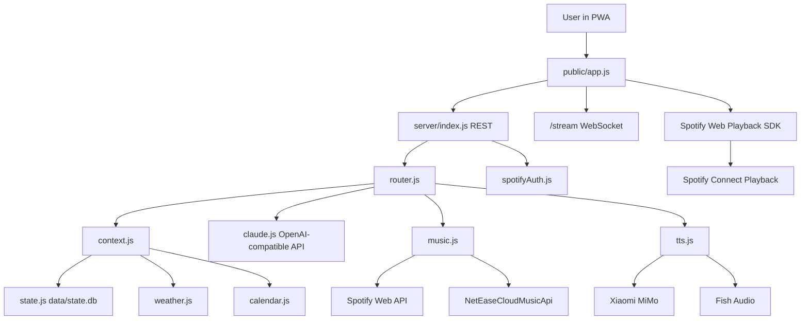

# Codio Architecture

## System Shape

Codio has four layers:

1. PWA player in `public/`
2. Local Node.js server in `server/`
3. AI brain through an OpenAI-compatible chat completions API
4. External services for music, weather, calendar, TTS and Spotify playback

The app is intentionally local-first. The browser talks only to the local server, and the local server owns credentials, state, routing and API calls.

## Runtime Flow

## Frontend

`public/app.js` owns:

- REST and WebSocket event handling
- Spotify Web Playback SDK setup
- queue rendering and manual next/previous
- progress seek and volume sync
- voice playback cancellation
- Card/Profile views
- like/dislike state updates
- Chrome user avatar and Codio avatar display

Important playback behavior:

- `cancelSpeech()` increments a speech session and stops browser/cloud TTS audio.
- `handleEvent()` processes server events in order.
- `shouldAvoidPlayRestart()` prevents a delayed `play` event from restarting the same song if it is already playing and progress is past 1.5 seconds.
- Spotify progress is synced from `player_state_changed` plus a polling watcher.

## Backend Modules

`server/index.js` is the HTTP boundary. It serves static files, exposes REST routes, owns Spotify callback handling and proxies NetEase audio streams.

`server/router.js` turns natural language into action events. It combines LLM output with deterministic intent parsing for language, genre, artist, discovery and self-introduction requests.

`server/context.js` builds the prompt context from persona, user taste files, imported Spotify samples, weather, calendar, memory and recent plays.

`server/claude.js` calls an OpenAI-compatible LLM and generates DJ host intros/chatter. It also has local fallback actions when quota, auth, model or network problems occur.

`server/curator.js` plans the 24-hour radio day. It creates time segments, rotates queries from taste data, refreshes queues and decides when Codio should speak.

`server/music.js` searches Spotify, NetEase or demo sources. Spotify tracks are playable in app when they have a URI and the browser SDK has a Premium session.

`server/tts.js` tries Xiaomi MiMo, Fish Audio or browser fallback depending on environment variables.

`server/state.js` persists messages, plays, plans, preferences, likes, dislikes and schedules in `data/state.db`.

## Data Model

`data/state.db` is a JSON document with:

- `persona`
- `preferences`
- `messages`
- `plays`
- `likes`
- `dislikes`
- `plans`
- `schedules`

Imported Spotify taste data lives in `user/imports/` and is read by `server/context.js` and `server/taste.js`.

## Music Source Strategy

Spotify is the preferred source for the user’s location and catalog needs. NetEase remains useful for Chinese search, lyrics and fallback experiments, but it is not reliable as the primary playback source outside mainland China because of region and VIP restrictions.

Demo mp3 tracks exist only to keep the UI testable when services are not configured.

## Weather And Calendar

`server/weather.js` uses OpenWeather when `OPENWEATHER_API_KEY` is present and falls back to Open-Meteo. Orlando and common Florida aliases are hard-coded so weather does not fail on broad Florida input.

`server/calendar.js` reads Feishu calendar when a user access token is configured; otherwise local schedules stay available.

## TTS

TTS provider order:

1. Xiaomi MiMo when `TTS_PROVIDER=xiaomi` or `auto` with Xiaomi key
2. Fish Audio when `TTS_PROVIDER=fish` or `auto` with Fish credentials
3. Browser speech synthesis fallback

Host intros are split in `server/hostIntro.js` so Codio does not speak one long block.
